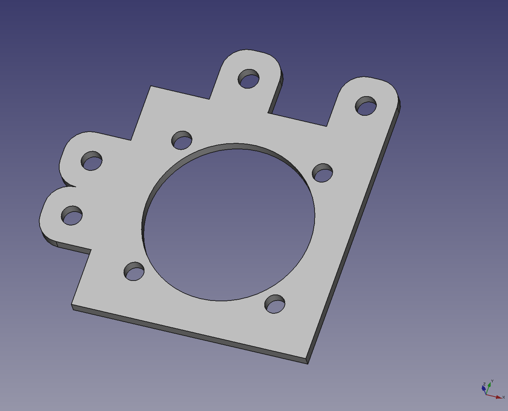
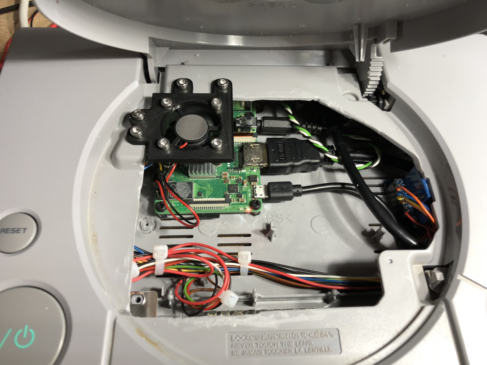

# A fan holder for my Pi-Station One

This part was designed with [FreeCAD](https://www.freecadweb.org/){:target="_blank"}.

- [FreeCAD file](rpi-fan-holder.FCStd)
- [3D printer friendly STL-file](rpi-fan-holder.stl)

